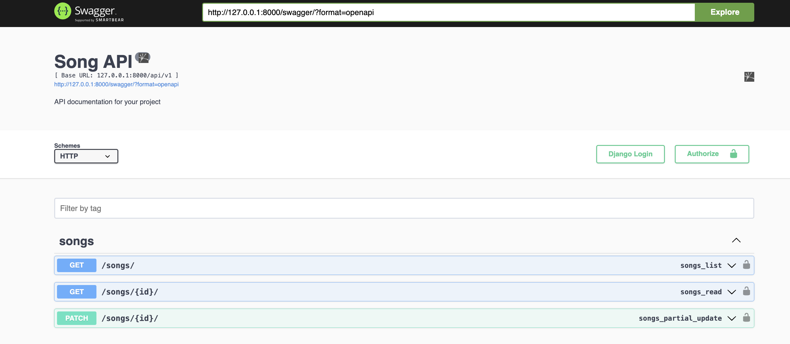
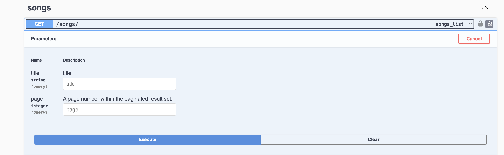
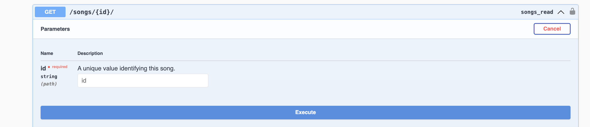
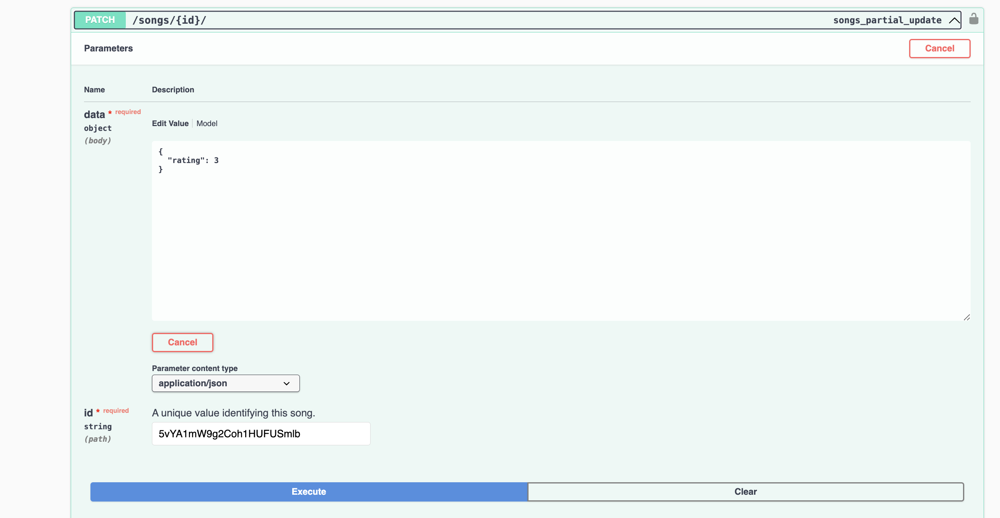

# Song REST Project

## Features

- Swagger documentation
- Docker support for easy deployment

### Prerequisites

- Python 3.9 or higher
- Django
- Docker (optional)

### Steps for Installation and Run Project

#### Without Docker
1. **Clone the repository**
```bash
git clone https://github.com/lakshit77/song_rest.git .
```
2. **Create Virtual Enviornment (optional but recommended)**
3. **Install dependency inside Virtual Enviornment from requirements.txt**
```bash
pip install -r requirements.txt
```
4. **Run Database Migrations**
```bash
python manage.py migrate
``` 
- Automatic all the Json Data will be added in database while running the migrate command
5. **Run Project**
```bash
python manage.py runserver
```
6. **Visit below URL to see the swagger documentation**
```bash
Visit http://127.0.0.1:8000/swagger to access the API with Documentation
```

7. **Run test case**
```bash
python manage.py test
```

#### With Docker or Docker compose

1. **You can provide any name instead of social_network**
```bash
docker build -t song_rest -f Dockerfile.local . 
docker run -p 8000:8000 song_rest

            or 

docker-compose up --build 
```


2. **Visit below URL to see the swagger documentation**
```bash
Visit http://localhost:8000/swagger to access the API with Documentation
```




#### API Usage Understanding

1. **Song List**

- You can use `/songs/` GET api to get all the songs with Pagination
- Pass the `title` value inside the box of `title` to filter the data according to title and get matching songs
- Inside `page` pass page number to get that set of data of songs

2. **Single Song Data**

- Use `/songs/{id}/` GET api to get single song data
- Inside `id` box pass the id of song to get it data

3. **Update Song Rating Data**

- Use `/songs/{id}/` PATCH api to change the rating of song
- Inside `id` box pass the id of song
- Pass rating value for the song

**Note:**
    - Rating value will be between 1 to 5


